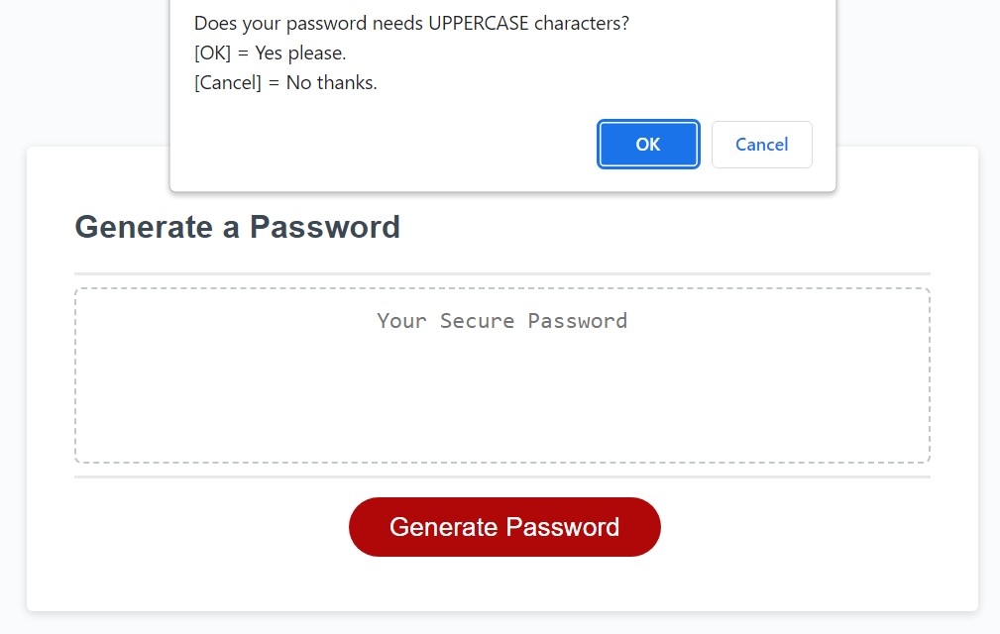

# Week-5 Challenge - Password Generator

## Description

As a review of the materials we learnt in our five week, our **Week 5 Challenge** will test our skills in intermediate JavaScript and logic by having us generate passwords with selected criteria by writing javascript codes.

In this web application, I have applied the following skills:

>01. JavaScript
>02. Google-fu
>03. Google-fu
>04. Google-fu
>05. Lots of tears
>06. Google-fu

## Installation

N/A

## Usage 

Click the big red "Generate Password" button to start the password helper. 

Password Generator Website:
https://damnsemicolon.github.io/password-generator-shannon

Screenshot of deployed website:

## Credits

Philip Howley (Instructor) 
Nic Catania (TA) 
Pod-4 mates 
Myself

## License

## Badges

